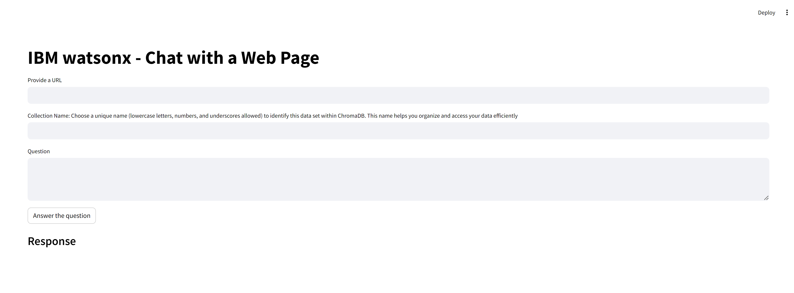

## How to Chat with a Website Using WatsonX

Hello everyone! Today, we're going to create an exciting web app that allows us to chat with any website using Watsonx.ai.

Watsonx.ai is a powerful SaaS service that leverages the full capabilities of IBM's cloud infrastructure. This tool provides a robust platform for integrating advanced AI functionalities into your applications, making it easier than ever to enhance user interactions with intelligent, context-aware responses.


## Step 1: Environment Creation

There are several ways to create an environment in Python. Follow these steps to set up your environment locally:

1. **Install Python 3.10**
   - Download and install Python 3.10 from [here](https://www.python.org/downloads/windows/).

2. **Create a Virtual Environment**
   - Open your terminal or command prompt and navigate to your project directory.
   - Run the following command to create a virtual environment:
     ```bash
     python -m venv .venv
     ```
   - This command creates a new directory named `.venv` in your current working directory.

3. **Activate the Virtual Environment**
   - **Windows:**
     ```bash
     .venv\Scripts\activate.bat
     ```
   - **Linux:**
     ```bash
     source .venv/bin/activate
     ```

4. **Upgrade pip**
   - Run the following command to upgrade pip:
     ```bash
     python -m pip install --upgrade pip
     ```

5. **Optional: Install JupyterLab for Development and Testing**
   - If you want to use JupyterLab, install it by running:
     ```bash
     pip install ipykernel jupyterlab
     ```

## Step 2: Setup Libraries

Once you have your environment set up and activated, you need to install the necessary libraries. Run the following command to install the required packages:

```bash
pip install streamlit python-dotenv  ibm_watson_machine_learning requests chromadb sentence_transformers spacy
```

```bash
python -m spacy download en_core_web_md
```

IMPORTANT: Be aware of the disk space that will be taken up by documents when they're loaded into
chromadb on your laptop. The size in chroma will likely be the same as .txt file size.

## Step 3: Getting API from IBM Cloud

### Obtaining an API Key

To obtain an API key from IBM Cloud, follow these steps:

1. **Sign In**
   - Go to [IBM Cloud](https://cloud.ibm.com) and sign in to your account.

2. **Navigate to Account Settings**
   - Click on your account name in the top right corner of the IBM Cloud dashboard.
   - From the dropdown menu, select "Manage" to go to the Account settings.

3. **Access API Keys**
   - In the left-hand menu, click on “IBM Cloud API keys” under the “Access (IAM)” section.

4. **Create an API Key**
   - On the “API keys” page, click on the “Create an IBM Cloud API key” button.
   - Provide a name and an optional description for your API key.
   - Select the appropriate access policies if needed.
   - Click on the “Create” button to generate the API key.

5. **Save Your API Key**
   - Once the API key is created, a dialog box displaying the API key value will appear.
   - Make sure to copy and save this key as it will not be shown again.

> Note: The steps above are based on the current IBM Cloud interface. They may vary slightly depending on any updates or changes. If you encounter any difficulties or if the steps do not match your IBM Cloud interface, refer to the IBM Cloud documentation or contact IBM support for assistance.

### Retrieving the Project ID for IBM Watsonx

To obtain the Project ID for IBM Watsonx, you will need access to the IBM Watson Machine Learning (WML) service. Follow these steps:

1. **Log In**
   - Log in to the [IBM Cloud Console](https://cloud.ibm.com) using your IBM Cloud credentials.

2. **Navigate to Watson Machine Learning**
   - Go to the Watson Machine Learning service.

3. **Access Service Instance**
   - Click on the service instance associated with your Watsonx project.

4. **Find Service Credentials**
   - In the left-hand menu, click on “Service credentials”.
   - Under the “Credentials” tab, you will find a list of service credentials associated with your Watsonx project.

5. **Retrieve Project ID**
   - Click on the name of the service credential you want to use.
   - In the JSON object, find the “project_id” field. The value of this field is your Project ID.

### Adding Credentials to Your Project

Add the API key and Project ID to the `.env` file in your project directory:

```plaintext
API_KEY=your_api_key
PROJECT_ID=your_project_id
```

This will configure your project to connect to Watsonx.ai using the obtained credentials.

## Step 4: Creation of app.py

In the followig section we are going to  invoke Large Language Models (LLMs) deployed in watsonx.ai. Documentation: [here](https://ibm.github.io/watson-machine-learning-sdk/foundation_models.html)
This example shows a Question and Answer use case for a provided web site


### Section 1: Importing Necessary Libraries

```python
# For reading credentials from the .env file
import os
from dotenv import load_dotenv

from sentence_transformers import SentenceTransformer
from chromadb.api.types import EmbeddingFunction

# WML python SDK
from ibm_watson_machine_learning.foundation_models import Model
from ibm_watson_machine_learning.metanames import GenTextParamsMetaNames as GenParams
from ibm_watson_machine_learning.foundation_models.utils.enums import ModelTypes, DecodingMethods

import requests
from bs4 import BeautifulSoup
import spacy
import chromadb
import en_core_web_md
```

**Explanation:**
- `os` and `dotenv` libraries are used for handling environment variables securely.
- `sentence_transformers` and `chromadb.api.types` are used for text embedding and database operations.
- `ibm_watson_machine_learning` SDK helps interact with IBM Watson models.
- `requests` and `BeautifulSoup` are used for web scraping.
- `spacy` is used for natural language processing tasks.

### Section 2: Setting Up Environment Variables

```python
# Important: hardcoding the API key in Python code is not a best practice. We are using
# this approach for the ease of demo setup. In a production application these variables
# can be stored in an .env or a properties file

# URL of the hosted LLMs is hardcoded because at this time all LLMs share the same endpoint
url = "https://us-south.ml.cloud.ibm.com"

# These global variables will be updated in get_credentials() function
watsonx_project_id = ""
# Replace with your IBM Cloud key
api_key = ""
```

**Explanation:**
- Hardcoding credentials is not recommended for production; use environment variables instead.
- `url` is the endpoint for IBM Watson models.
- `watsonx_project_id` and `api_key` will be populated from environment variables.

### Section 3: Loading Credentials

```python
def get_credentials():
    load_dotenv()
    # Update the global variables that will be used for authentication in another function
    globals()["api_key"] = os.getenv("api_key", None)
    globals()["watsonx_project_id"] = os.getenv("project_id", None)
```

**Explanation:**
- `get_credentials` function loads the `.env` file and updates global variables for `api_key` and `watsonx_project_id`.

### Section 4: Creating the Model

```python
def get_model(model_type, max_tokens, min_tokens, decoding, temperature, top_k, top_p):
    generate_params = {
        GenParams.MAX_NEW_TOKENS: max_tokens,
        GenParams.MIN_NEW_TOKENS: min_tokens,
        GenParams.DECODING_METHOD: decoding,
        GenParams.TEMPERATURE: temperature,
        GenParams.TOP_K: top_k,
        GenParams.TOP_P: top_p,
    }

    model = Model(
        model_id=model_type,
        params=generate_params,
        credentials={
            "apikey": api_key,
            "url": url
        },
        project_id=watsonx_project_id
    )

    return model
```

**Explanation:**
- `get_model` function initializes a Watson model with specified parameters like `max_tokens`, `decoding` method, `temperature`, etc.
- Credentials and project ID are passed to authenticate the model.

### Section 5: Embedding Function

```python
class MiniLML6V2EmbeddingFunction(EmbeddingFunction):
    MODEL = SentenceTransformer('all-MiniLM-L6-v2')

    def __call__(self, texts):
        return MiniLML6V2EmbeddingFunction.MODEL.encode(texts).tolist()
```

**Explanation:**
- `MiniLML6V2EmbeddingFunction` class uses `SentenceTransformer` to convert text into embeddings, which are numeric representations of the text.

### Section 6: Extracting Text from a Webpage

```python
def extract_text(url):
    try:
        # Send an HTTP GET request to the URL
        response = requests.get(url)

        # Check if the request was successful
        if response.status_code == 200:
            # Parse the HTML content of the page using BeautifulSoup
            soup = BeautifulSoup(response.text, 'html.parser')

            # Extract contents of <p> elements
            p_contents = [p.get_text() for p in soup.find_all('p')]

            # Print the contents of <p> elements
            print("\nContents of <p> elements: \n")
            for content in p_contents:
                print(content)
            raw_web_text = " ".join(p_contents)
            # remove \xa0 which is used in html to avoid words break acorss lines.
            cleaned_text = raw_web_text.replace("\xa0", " ")
            return cleaned_text

        else:
            print(f"Failed to retrieve the page. Status code: {response.status_code}")

    except Exception as e:
        print(f"An error occurred: {str(e)}")
```

**Explanation:**
- `extract_text` function scrapes text content from `<p>` tags of a given webpage URL using `requests` and `BeautifulSoup`.

### Section 7: Splitting Text into Sentences

```python
def split_text_into_sentences(text):
    nlp = spacy.load("en_core_web_md")
    doc = nlp(text)
    sentences = [sent.text for sent in doc.sents]
    cleaned_sentences = [s.strip() for s in sentences]
    return cleaned_sentences
```

**Explanation:**
- `split_text_into_sentences` function uses `spaCy` to split the extracted text into sentences and clean them.

### Section 8: Creating Embeddings

```python
def create_embedding(url, collection_name, client):
    cleaned_text = extract_text(url)
    cleaned_sentences = split_text_into_sentences(cleaned_text)
    collection = client.get_or_create_collection(collection_name)

    # Upload text to chroma
    collection.upsert(
        documents=cleaned_sentences,
        metadatas=[{"source": str(i)} for i in range(len(cleaned_sentences))],
        ids=[str(i) for i in range(len(cleaned_sentences))],
    )

    return collection
```

**Explanation:**
- `create_embedding` function extracts, cleans, and splits text, then uploads it to a Chroma database collection.

### Section 9: Creating a Prompt for the Model

```python
def create_prompt(url, question, collection_name,client):
    
    # Create embeddings for the text file
    collection = create_embedding(url, collection_name,client)

    # query relevant information
    relevant_chunks = collection.query(
        query_texts=[question],
        n_results=5,
    )
    context = "\n\n\n".join(relevant_chunks["documents"][0])
    # Please note that this is a generic format. You can change this format to be specific to llama
    prompt = (f"{context}\n\nPlease answer the following question in one sentence using this "
              + f"text. "
              + f"If the question is unanswerable, say \"unanswerable\". Do not include information that's not relevant to the question."
              + f"Question: {question}")

    return prompt
```

**Explanation:**
- `create_prompt` function generates a prompt by querying the Chroma database for relevant text chunks based on a question and constructs a formatted prompt.

### Section 10: Main Function

```python
def main():

    # Get the API key and project id and update global variables
    get_credentials()

    # Try diffrent URLs and questions
    url = "https://huggingface.co/learn/nlp-course/chapter1/2?fw=pt"

    question = "What is NLP?"

    collection_name = "test_web_RAG"

    answer_questions_from_web(api_key, watsonx_project_id, url, question, collection_name)
```

**Explanation:**
- `main` function initializes credentials and runs the process to answer a question based on the content from a given URL.

### Section 11: Answering Questions from the Web

```python
def answer_questions_from_web(request_api_key, request_project_id, url, question, collection_name):
    # Update the global variable
    globals()["api_key"] = request_api_key
    globals()["watsonx_project_id"] = request_project_id

    # Specify model parameters
    model_type = "meta-llama/llama-2-70b-chat"
    max_tokens = 100
    min_tokens = 50
    top_k = 50
    top_p = 1
    decoding = DecodingMethods.GREEDY
    temperature = 0.7

    # Get the watsonx model = try both options
    model = get_model(model_type, max_tokens, min_tokens, decoding, temperature, top_k, top_p)
    # Get client Chromadb
    client = chromadb.Client()
    # Get the prompt
    complete_prompt = create_prompt(url, question, collection_name,client)

    # Let's review the prompt
    print("----------------------------------------------------------------------------------------------------")
    print("*** Prompt:" + complete_prompt + "***")
    print("----------------------------------------------------------------------------------------------------")

    generated_response = model.generate(prompt=complete_prompt)
    response_text = generated_response['results'][0]['generated_text']

    # Remove trailing white spaces
    response_text = response

_text.strip()

    # print model response
    print("--------------------------------- Generated response -----------------------------------")
    print(response_text)
    print("*********************************************************************************************")

    return response_text
```

**Explanation:**
- `answer_questions_from_web` function updates the global variables, initializes the model, creates a prompt, generates a response, and prints the answer.

### Section 12: Running the Script

```python
# Invoke the main function
if __name__ == "__main__":
    main()
```

**Explanation:**
- This code block ensures that the `main` function is called when the script is run directly.

By breaking down the code into these sections, readers can understand the role of each part and how they work together to create a web chat application using Watsonx.ai.


### Explanation of `run.py` Code

Let's break down and explain the `run.py` code step-by-step:

#### Section 1: Importing Necessary Libraries

```python
# For reading credentials from the .env file
import os
from dotenv import load_dotenv
import streamlit as st
import webchat
```

**Explanation:**
- `os` and `dotenv` are used to load environment variables.
- `streamlit` is a library for creating interactive web applications.
- `webchat` is a module that contains functions for interacting with IBM Watson models.

#### Section 2: Setting Up Environment Variables

```python
# URL of the hosted LLMs is hardcoded because at this time all LLMs share the same endpoint
url = "https://us-south.ml.cloud.ibm.com"

# These global variables will be updated in get_credentials() function
watsonx_project_id = ""
api_key = ""
```

**Explanation:**
- `url` is the endpoint for IBM Watson models.
- `watsonx_project_id` and `api_key` are initialized and will be populated with actual values from environment variables.

#### Section 3: Loading Credentials

```python
def get_credentials():
    load_dotenv()
    # Update the global variables that will be used for authentication in another function
    globals()["api_key"] = os.getenv("API_KEY", "")
    globals()["watsonx_project_id"] = os.getenv("PROJECT_ID", "")
```

**Explanation:**
- `get_credentials` function loads the environment variables from a `.env` file and updates the global `api_key` and `watsonx_project_id`.

#### Section 4: Streamlit Application Setup

```python
def main():
    # Get the API key and project id and update global variables
    get_credentials()

    # Use the full page instead of a narrow central column
    st.set_page_config(layout="wide")

    # Streamlit app title
    st.title("IBM watsonx - Chat with a Web Page")

    # Sidebar for settings
    st.sidebar.header("Settings")
    api_key_input = st.sidebar.text_input("API Key", api_key)
    project_id_input = st.sidebar.text_input("Project ID", watsonx_project_id)
    
    # Update credentials if provided by the user
    if api_key_input:
        globals()["api_key"] = api_key_input
    if project_id_input:
        globals()["watsonx_project_id"] = project_id_input

    user_url = st.text_input('Provide a URL')
    collection_name = st.text_input('Collection Name:  Choose a unique name (lowercase letters, numbers, and underscores allowed) to identify this data set within ChromaDB. This name helps you organize and access your data efficiently')

    # UI component to enter the question
    question = st.text_area('Question', height=100)
    button_clicked = st.button("Answer the question")

    st.subheader("Response")

    # Invoke the LLM when the button is clicked
    if button_clicked:
        response = webchat.answer_questions_from_web(api_key, watsonx_project_id, user_url, question, collection_name)
        st.write(response)
```

**Explanation:**
- `main` function sets up the Streamlit application.
- `get_credentials` is called to load API credentials.
- `st.set_page_config` configures the page layout.
- Streamlit UI components are defined:
  - Title and sidebar settings for API key and project ID.
  - Text input fields for URL and collection name.
  - Text area for the question.
  - Button to trigger the question answering process.
- When the button is clicked, `webchat.answer_questions_from_web` function is called to get the response, which is then displayed on the page.

#### Section 5: Running the Application

```python
if __name__ == "__main__":
    main()
```


```
streamlit run run.py
```




**Explanation:**
- Ensures that the `main` function is executed when the script is run directly.

### Summary of the Program

The provided code sets up an interactive web application using Streamlit to demonstrate a Retrieval-Augmented Generation (RAG) system. The system allows users to input a URL, which is then scraped for content. This content is embedded and stored in a database. Users can ask questions related to the content, and the system uses IBM Watson's language model to generate relevant answers. The application handles authentication via environment variables and allows users to update credentials through the UI.

### Conclusion

In this blog post, we've explored a Python-based web chat application using Watsonx.ai and IBM Watson's powerful language models. The application demonstrates how to build a Retrieval-Augmented Generation (RAG) system that scrapes web content, embeds it, and leverages machine learning to answer user questions. By breaking down the code into manageable sections, we've provided a comprehensive guide to understanding and implementing such a system. This application showcases the potential of combining web scraping, natural language processing, and interactive web frameworks to create sophisticated AI-driven solutions.
